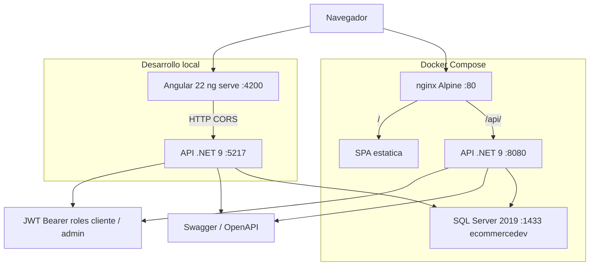
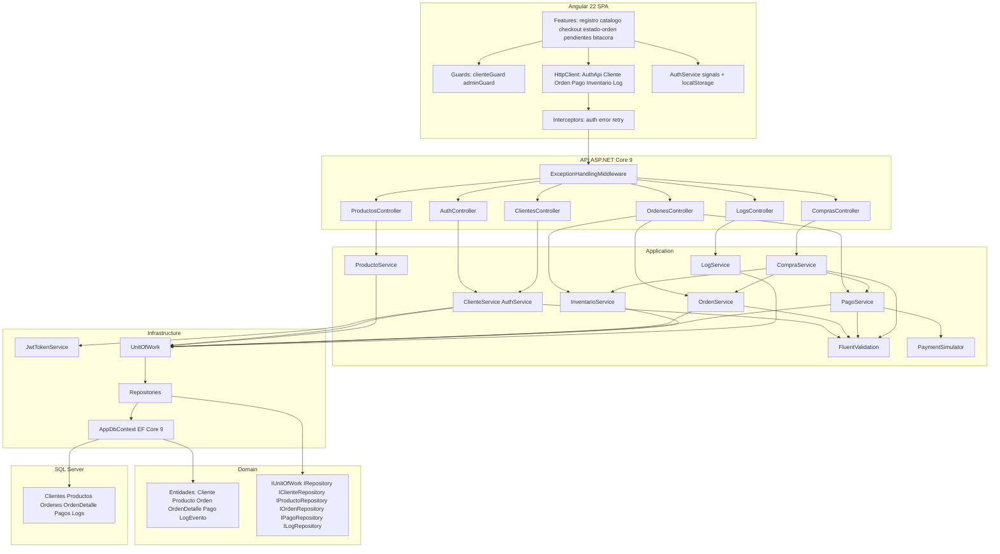
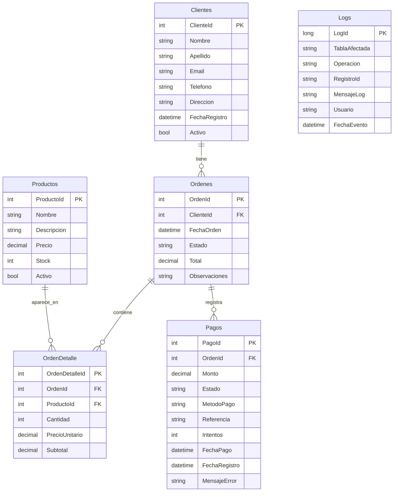
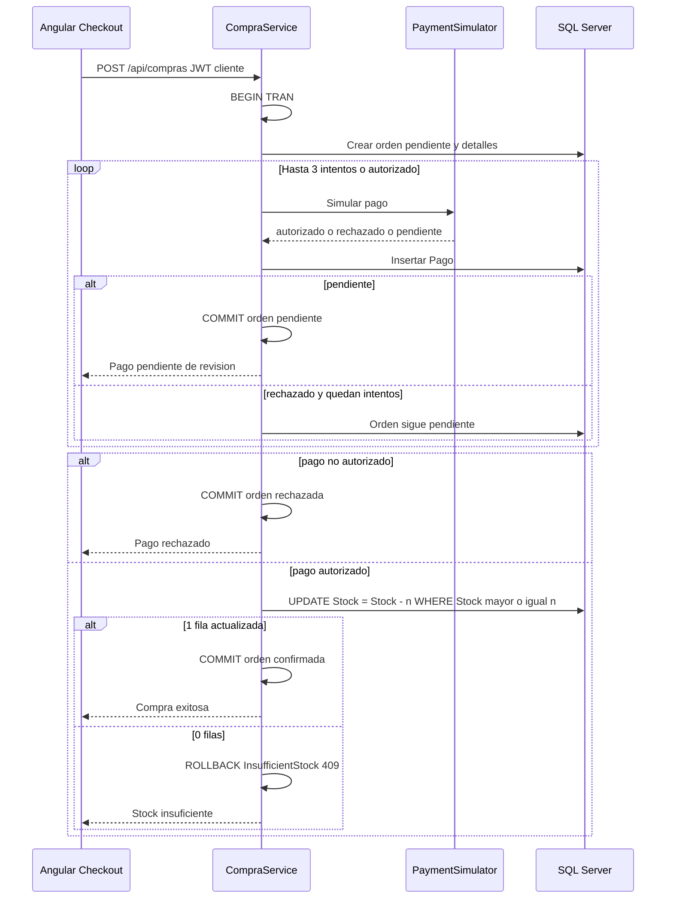

# Arquitectura MyECommerceWebApp

Monolito modular: SPA Angular 22, API ASP.NET Core 9 y SQL Server. No hay microservicios, Identity, Redis, SignalR ni pasarela de pago real.

## Diagrama 1 — Contenedores y despliegue

Local: Angular `http://localhost:4200` llama a la API `http://localhost:5217` con CORS. Docker: nginx `:80` sirve la SPA y hace proxy de `/api/` a `http://api:8080/api/`. SQL Server 2019, base `ecommercedev`.

---

## Diagrama 2 — Capas internas

Un solo proyecto Web API con carpetas Clean Architecture. El frontend es standalone (sin NgModules), rutas lazy, signals y `localStorage`. El carrito no se persiste: las cantidades viven en el checkout.

### Mapeo frontend → API

| Angular | Endpoint | Auth API |
|---------|----------|----------|
| `AuthApiService` | `POST /api/auth/identificar`, `POST /api/auth/admin` | Anonimo |
| `ClienteService` | `POST /api/clientes`, `GET /api/clientes/{id}` | Anonimo / Authorize |
| `InventarioService` | `GET /api/productos`, `POST /api/ordenes/{id}/inventario` | Anonimo / Admin |
| `OrdenService` | `POST /api/compras`, `GET/POST /api/ordenes...` | Cliente / Admin |
| `PagoService` | `POST /api/ordenes/{id}/pagos`, `.../pagos/reintentar` | Cliente |
| `LogService` | `GET/POST /api/logs` | Admin |

---

## Diagrama 3 — Modelo de datos (ER)

El modelo EF replica `db_script.sql`. No hay tabla de carrito, kardex ni catalogo de categorias: el stock vive en `Productos.Stock` y el historial en `Logs` (`INVENTARIO`).

- `OrdenDetalle.Subtotal` es columna calculada almacenada: `Cantidad * PrecioUnitario`.
- Unique `(OrdenId, ProductoId)` en `OrdenDetalle`.
- Delete: cascade `Ordenes` → `OrdenDetalle`; restrict `Productos` → `OrdenDetalle`, `Clientes` → `Ordenes`, `Ordenes` → `Pagos`.
- Estados orden: `pendiente`, `confirmada`, `cancelada`, `rechazada`.
- Estados pago: `autorizado`, `rechazado`, `pendiente`.
- Operaciones log: `INSERT`, `UPDATE`, `DELETE`, `ERROR`, `PAGO`, `INVENTARIO`.

---

## Diagrama 4 — Secuencia de compra

`POST /api/compras` (policy `Cliente`) orquesta crear orden, simular pago (hasta 3 intentos) y descontar stock en una transaccion EF. `PaymentSimulator`: referencia que termina en `0000` → `rechazado`; monto mayor a `10000` → `pendiente` (revision admin); resto → `autorizado`.

---

## Autenticacion

- Cliente: `POST /api/clientes` (registro) o `POST /api/auth/identificar` (email, sin password). JWT rol `cliente` y claim `clienteId`.
- Admin demo: `POST /api/auth/admin` con clave `demo-admin`. JWT rol `admin`.
- Frontend: token en `localStorage`; `authInterceptor` envia `Authorization: Bearer`; `errorInterceptor` hace logout en 401.
- Policies API: `Cliente` → `RequireRole("cliente")`; `Admin` → `RequireRole("admin")`.
