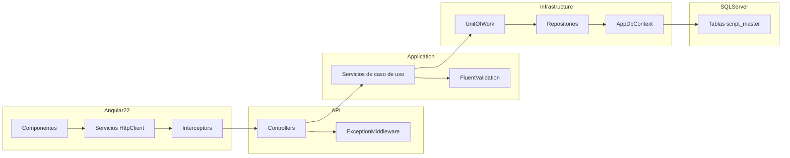
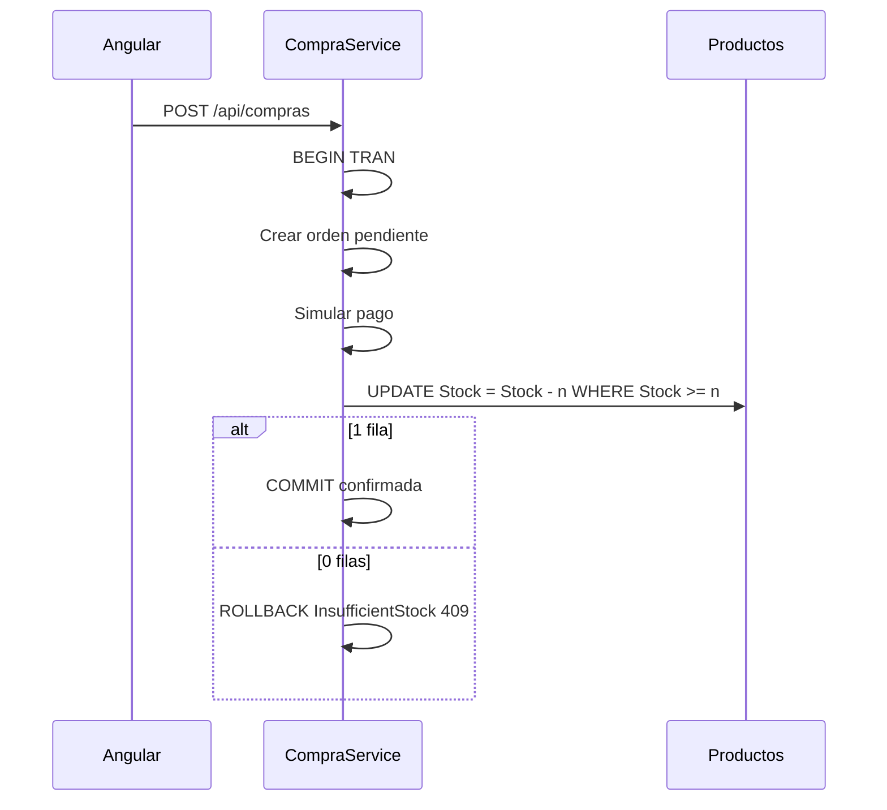

# Arquitectura

## Capas

## Flujo de compra y stock concurrente

## Tablas

El modelo EF replica `script_master.sql`: `Clientes`, `Productos`, `Ordenes`, `OrdenDetalle`, `Pagos`, `Logs`.

No hay tabla de kardex ni catalogo separado: el stock vive en `Productos.Stock` y el historial en `Logs` (`INVENTARIO`).

## Autenticacion

- Cliente: registro o identificacion por email, JWT rol `cliente`.
- Admin demo: `POST /api/auth/admin` con clave `demo-admin`.
