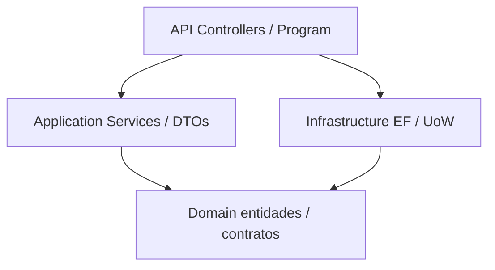

# Architechture & Scaffolding
_Exported on 8/16/2026 at 22:11:15 CST from Cursor (3.16.17)_

---

**User**

Necesito que analices el proyecto que está en esta carpeta, consta de una solución en .NET Core 9 y un proyecto con Angular 22.

---

**Cursor**

Voy a revisar la estructura de la carpeta y los archivos principales de la solución .NET y del proyecto Angular para darte un análisis claro.

El proyecto está en **estado inicial de scaffolding**: hay un backend ASP.NET Core 9 y un frontend Angular 22, pero **aún no hay e-commerce** ni integración entre ambos.

## Estructura

```
c:\MyECommerceWebApp\
├── MyECommerceWebApp.sln          ← solución Visual Studio (vacía)
├── MyECommerceWebApp\             ← API .NET 9
└── MyECommerceWebApp.Application\ ← Angular 22 (SSR)
```

Los dos proyectos viven juntos en la carpeta, pero **no están conectados**: no hay CORS, proxy, `HttpClient`, autenticación ni referencias entre ellos.

Hay un detalle de nomenclatura: en .NET, `.Application` suele ser la capa de casos de uso. Aquí `MyECommerceWebApp.Application` es el **frontend Angular**, no una capa de aplicación del backend.

---

## Backend: ASP.NET Core 9

Proyecto web mínimo (`Microsoft.NET.Sdk.Web`), target `net9.0`, nullable y implicit usings activados.

**Dependencias:** solo `Microsoft.AspNetCore.OpenApi` 9.0.0. No hay EF Core, Identity, JWT, Swagger UI ni paquetes de e-commerce.

**Lo que hace hoy:** un endpoint de plantilla:

```22:34:c:\MyECommerceWebApp\MyECommerceWebApp\Program.cs
app.MapGet("/weatherforecast", () =>
{
    var forecast =  Enumerable.Range(1, 5).Select(index =>
        new WeatherForecast
        (
            DateOnly.FromDateTime(DateTime.Now.AddDays(index)),
            Random.Shared.Next(-20, 55),
            summaries[Random.Shared.Next(summaries.Length)]
        ))
        .ToArray();
    return forecast;
})
.WithName("GetWeatherForecast");
```

**Pipeline:** OpenAPI solo en Development, HTTPS redirection. No hay CORS, autenticación, controllers ni capas.

**Puertos** (`launchSettings.json`):

| Perfil | URL |
|--------|-----|
| http | `http://localhost:5217` |
| https | `https://localhost:7287` |

Hay un archivo `.http` para probar `/weatherforecast`. El proyecto ya se compiló (`bin/` y `obj/` presentes).

**Problema de la solución:** `MyECommerceWebApp.sln` no incluye el `.csproj`. Abrir la `.sln` no carga el API.

---

## Frontend: Angular 22

Es el template oficial de Angular CLI con **SSR**.

| Pieza | Valor |
|--------|--------|
| Angular | `^22.1.0` |
| CLI / build | `^22.1.4` |
| TypeScript | `~6.0.2` |
| Tests | Vitest + jsdom |
| SSR | `@angular/ssr` + Express 5 |
| Estilo | standalone components, signals, control flow (`@for`) |

**Arquitectura Angular:**

- `bootstrapApplication` (no NgModules)
- Rutas vacías: `export const routes: Routes = []`
- Hydration de cliente (`provideClientHydration`)
- SSR con prerender de todas las rutas (`RenderMode.Prerender` en `**`)
- Servidor Express en puerto **4000** (`src/server.ts`)
- UI: página de bienvenida de Angular (“Hello, MyECommerceWebApp.Application”)

No hay componentes de catálogo, carrito, checkout, login ni servicios HTTP hacia el API.

---

## Qué falta para un e-commerce real

**Integración**
- CORS en el API (o proxy de Angular hacia `localhost:5217` / `7287`)
- `provideHttpClient` y servicios en Angular
- Incluir el `.csproj` en la `.sln`

**Backend típico**
- EF Core + base de datos
- Entidades: Product, Category, Cart, Order, User
- Endpoints REST (o Minimal APIs) reales
- Autenticación (JWT / Identity / cookies)
- Swagger UI, validación, manejo de errores

**Frontend típico**
- Rutas: catálogo, detalle, carrito, checkout, cuenta
- Estado del carrito
- Formularios reactivos
- Interceptor de auth

**Arquitectura .NET (si quieres capas)**
- Domain / Application / Infrastructure / API
- Hoy todo está en un solo `Program.cs`

---

## Cómo arrancarlos ahora

Backend:

```bash
cd MyECommerceWebApp
dotnet run --launch-profile https
```

Frontend:

```bash
cd MyECommerceWebApp.Application
npm start
```

Angular suele quedar en `http://localhost:4200`. El API y Angular corren por separado; llamar al forecast desde el browser Angular fallaría por CORS hasta que lo configures.

---

En resumen: es una **base limpia y moderna** (Minimal APIs + Angular 22 SSR), no un e-commerce implementado. Si quieres, el siguiente paso puede ser un plan de arquitectura (capas .NET, modelo de datos y módulos Angular) o el diseño concreto de la primera feature (por ejemplo catálogo de productos). Estoy en modo Ask: puedo orientar el diseño, pero no aplicar cambios hasta que pases a Agent mode.

---

**User**

Para iniciar, genera el scaffolding para una api en .net para diseñar e implementar una arquitectura Unit of Work / Repository con Entity Framework Core, generando endpoints REST. Una vez creadas las carpetas y las estructura solida del scaffolding que funga con el propósito, detente, ya que te solicitaré los pasos para importar los paquetes nuget necesarios de cada carpeta en el proyecto de la API (BACKEND).

---

**Cursor**

Voy a armar el scaffolding de capas (Domain, Application, Infrastructure) con Unit of Work/Repository y controladores REST dentro del API, sin instalar paquetes NuGet.

El scaffolding del API ya está en `MyECommerceWebApp`. No instalé paquetes NuGet, como pediste.

## Estructura

Las capas viven como carpetas dentro del proyecto backend (un solo `.csproj`):

```
MyECommerceWebApp/
├── Domain/                  Contratos y modelo (sin EF)
│   ├── Common/              BaseEntity
│   ├── Entities/            Product, Category
│   └── Interfaces/          IRepository<T>, IProductRepository, ICategoryRepository, IUnitOfWork
├── Application/             Casos de uso (sin EF)
│   ├── DTOs/
│   ├── Interfaces/          IProductService, ICategoryService
│   ├── Mappings/
│   ├── Services/            orquestan el Unit of Work
│   └── DependencyInjection.cs
├── Infrastructure/          Persistencia EF Core
│   ├── Persistence/         AppDbContext + Fluent API
│   ├── Repositories/        Repository<T>, repos concretos, UnitOfWork
│   └── DependencyInjection.cs
├── Controllers/             REST
└── Program.cs               AddApplication + AddInfrastructure + MapControllers
```

El flujo es: **Controller → Service → IUnitOfWork → Repository → AppDbContext**.

`Product` y `Category` son el dominio de arranque para validar el patrón (relación 1:N, timestamps en `SaveChangesAsync`). El proyecto ya está incluido en `MyECommerceWebApp.sln`.

## Endpoints REST

| Método | Ruta |
|--------|------|
| GET/POST | `/api/categories` |
| GET/PUT/DELETE | `/api/categories/{id}` |
| GET/POST | `/api/products` |
| GET/PUT/DELETE | `/api/products/{id}` |
| GET | `/api/products/by-category/{categoryId}` |

Hay ejemplos en `MyECommerceWebApp.http`. Connection string de LocalDB: `ConnectionStrings:DefaultConnection` en `appsettings.json`.

## Importante

El código de **Infrastructure** referencia Entity Framework Core. **No va a compilar** hasta que agregues los paquetes. Domain y Application no dependen de EF.

Cuando quieras, pide los pasos de NuGet por carpeta/capa y te indico exactamente qué instalar y en qué orden.

---

**User**

Dame los pasos de istalación de los NuGet necesarios por carpeta/capa

---

**Cursor**

Voy a revisar el `.csproj` y las referencias reales de cada capa para listar solo los paquetes NuGet que el scaffolding necesita.

---

**User**

Analiza nuevamente la estrutura del proyecto y el scaffolding creado, con base en ese análisis, me recomendarías separar las capas en diferentes ".csproj" dentro de la misma solución? ya que temo por que los paquetes que instale choquen entre sí en el mismo ".csproj"

---

**Cursor**

Voy a revisar la estructura actual y las dependencias reales de cada capa para recomendarte si conviene separar proyectos o no.

**No te recomendaría separar las capas ahora por miedo a que los paquetes “choquen”.** Ese problema casi no existe en tu situación. **Sí te las separaría más adelante (o ahora, si quieres imponer límites de verdad)** por otra razón: que Domain/Application no puedan usar Entity Framework ni por accidente.

## Qué hay hoy

Todo el backend es **un solo ensamblado**: [`MyECommerceWebApp.csproj`](MyECommerceWebApp/MyECommerceWebApp.csproj). Las carpetas `Domain`, `Application`, `Infrastructure` y `Controllers` son organización, no aislamiento.

Las dependencias reales del código son estas:

| Capa | Referencias actuales | ¿NuGet propio? |
|------|----------------------|----------------|
| **Domain** | Solo tipos propios (`BaseEntity`, entidades, `IRepository`, `IUnitOfWork`) | No |
| **Application** | Domain + `DataAnnotations` + DI | No (viene del SDK) |
| **Infrastructure** | Domain + `Microsoft.EntityFrameworkCore` | Sí (EF + SqlServer) |
| **API** | Application + Infrastructure + MVC/OpenAPI | OpenAPI ya está |

Infrastructure **no** usa Application. Application **no** usa Infrastructure. Eso ya está bien para Clean Architecture; las carpetas no lo **obligan**.



## Los paquetes no chocan por estar en el mismo `.csproj`

NuGet no se instala “por carpeta”. Todo `PackageReference` aplica al **proyecto entero**.

Los que necesitas conviven a propósito:

- `Microsoft.AspNetCore.OpenApi` 9.x
- `Microsoft.EntityFrameworkCore` 9.x
- `Microsoft.EntityFrameworkCore.SqlServer` 9.x
- `Design` / `Tools` 9.x

El choque típico no es “EF vs OpenAPI”, sino **mezclar versiones de la misma familia** (por ejemplo EF 8 con EF 9). Eso se evita usando **9.0.19 en todos** los `Microsoft.EntityFrameworkCore.*`, no partiendo el `.csproj`.

Tener EF en el mismo proyecto que Domain **no corrompe** las entidades. El riesgo es humano: alguien puede escribir `using Microsoft.EntityFrameworkCore` en `Domain` o `Application` y el compilador lo acepta, porque es el mismo ensamblado.

## Entonces, ¿separar `.csproj`?

**Por el miedo a NuGet: no es necesario.**  
**Por arquitectura a medio/largo plazo: sí tiene sentido**, porque el compilador bloquea fugas de dependencias.

Con proyectos separados:

- Domain **no puede** referenciar EF (no hay `PackageReference` ahí).
- Application solo ve Domain.
- Infrastructure es el único que carga SQL Server.
- El API es el host: OpenAPI, controllers, `AddApplication()` + `AddInfrastructure()`.

Eso es lo que las carpetas no pueden garantizar.

Para **este** scaffolding (2 entidades, un API, Angular al lado), un solo `.csproj` es válido y más simple. Separar ahora tiene costo: 3 class libraries, `ProjectReference`, migraciones `dotnet ef` con `--startup-project` / `--project`, y un **conflicto de nombre** con Angular.

Hoy Angular ya ocupa la carpeta [`MyECommerceWebApp.Application`](MyECommerceWebApp.Application). Un proyecto C# con el mismo nombre en la raíz de la solución **chocaría en disco**. Habría que usar otra ruta o otro nombre, por ejemplo:

```
MyECommerceWebApp.sln
MyECommerceWebApp.Application/          ← Angular (no tocar)
MyECommerceWebApp.Domain/
MyECommerceWebApp.Core/                 ← capa Application C# (evitar el nombre)
MyECommerceWebApp.Infrastructure/
MyECommerceWebApp/                      ← API host
```

o todo el backend bajo `src/` y dejar Angular en la raíz.

## Recomendación práctica

1. **Instala los paquetes en el `.csproj` actual** (solo EF + SqlServer + Design/Tools). No van a pelearse con OpenAPI.
2. **Mantén la regla de capas a mano:** EF solo en `Infrastructure/`; Domain y Application sin `using` de EF.
3. **Separa proyectos cuando** agregues Identity, pagos, colas, más equipos, o notes que Application empieza a usar `DbContext` / `DbSet`.

Si quieres el candado de compilación desde ya, separar **sí** vale la pena, pero por **dirección de dependencias**, no por colisión de NuGet. En ese caso el nombre de la capa Application en C# no puede ser `MyECommerceWebApp.Application`.

Si más adelante quieres que te haga el split, cambia a Agent mode y lo armamos en la solución.

